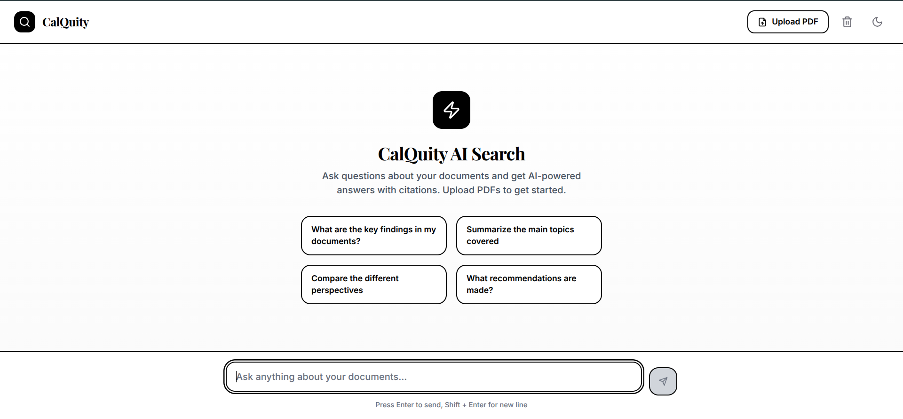
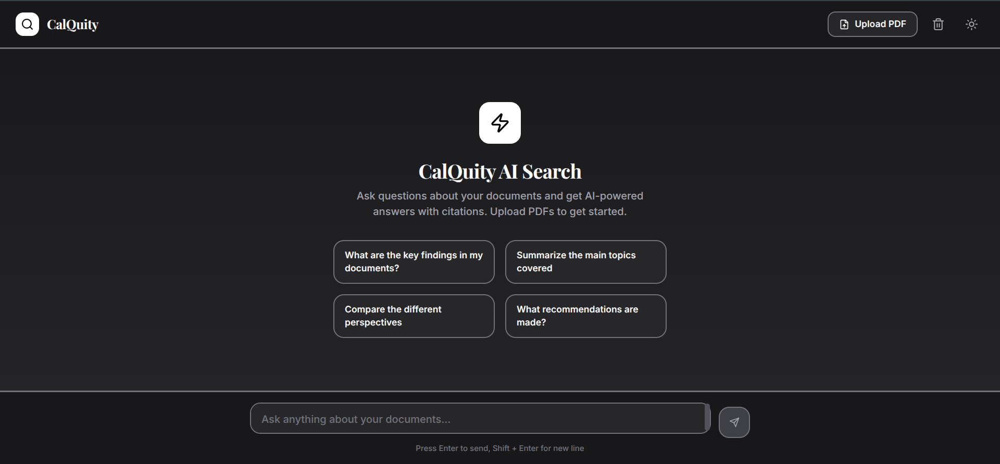

# CalQuity AI Search Chat

A Perplexity-style AI search chat interface with PDF citation viewer and generative UI components. Built with Next.js 14+ (App Router) and Python FastAPI.


## ✨ Features

### Core Features
- **Perplexity-style Chat Interface** - Clean, centered chat layout with streaming responses
- **Real-time Streaming** - Server-Sent Events (SSE) for smooth response streaming
- **Generative UI Components** - Charts, tables, and cards that render progressively
- **Inline Citations** - Clickable `[1]`, `[2]` badges linking to source documents
- **Tool Call Indicators** - Visual feedback for AI reasoning steps
- **PDF Viewer with Transitions** - Smooth animated transitions to split-view layout
- **Dark Mode** - Full dark mode support with theme persistence

### PDF Viewer Features
- Page navigation with keyboard shortcuts
- Zoom in/out with reset
- Citation text highlighting
- Search functionality (UI ready)
- Responsive layout (full screen on mobile, split view on desktop)

### Technical Features
- **Queue System** - In-memory async queue for request management
- **State Management** - Zustand for global state with persistence
- **Type Safety** - Full TypeScript and Python type hints
- **Error Handling** - Graceful failures with user-friendly messages

## 🏗️ Architecture

```
┌─────────────────────────────────────────────────────────────────┐
│                         Frontend (Next.js)                       │
│  ┌───────────┐  ┌──────────────┐  ┌─────────────────────────┐  │
│  │   Chat    │  │   PDF        │  │   Generative UI         │  │
│  │ Interface │  │   Viewer     │  │   Components            │  │
│  └─────┬─────┘  └──────┬───────┘  └───────────┬─────────────┘  │
│        │               │                       │                 │
│        └───────────────┴───────────────────────┘                │
│                         │                                        │
│                   Zustand Store                                  │
│                   TanStack Query                                 │
└─────────────────────────┬───────────────────────────────────────┘
                          │ SSE / REST
                          ▼
┌─────────────────────────────────────────────────────────────────┐
│                         Backend (FastAPI)                        │
│  ┌───────────┐  ┌──────────────┐  ┌─────────────────────────┐  │
│  │   Chat    │  │   PDF        │  │   Queue                 │  │
│  │   API     │  │   Processing │  │   Service               │  │
│  └─────┬─────┘  └──────┬───────┘  └───────────┬─────────────┘  │
│        │               │                       │                 │
│        └───────────────┴───────────────────────┘                │
│                         │                                        │
│                   AI Service                                     │
│                (Streaming Generator)                             │
└─────────────────────────────────────────────────────────────────┘
```

### Streaming Protocol

The SSE streaming protocol follows this event sequence:

1. **Tool Calls** - Reasoning steps (thinking, searching, analyzing)
2. **Text Chunks** - Incremental response text
3. **Citations** - Citation data for inline references
4. **UI Components** - Generative UI component definitions
5. **Source Cards** - Document source metadata
6. **Done** - Stream completion signal

## 🚀 Quick Start

### Prerequisites

- Node.js 18+ 
- Python 3.11+
- npm or yarn

### Option 1: Docker (Recommended)

```bash
# Clone the repository
git clone <repository-url>
cd CalQuity

# Start with Docker Compose
docker-compose up --build

# Access the app
# Frontend: http://localhost:3000
# Backend: http://localhost:8000
```

### Option 2: Local Development

#### Backend Setup

```bash
# Navigate to backend directory
cd backend

# Create virtual environment
python -m venv venv
source venv/bin/activate  # On Windows: venv\Scripts\activate

# Install dependencies
pip install -r requirements.txt

# Copy environment file
cp .env.example .env

# Run the server
uvicorn app.main:app --reload --host 0.0.0.0 --port 8000
```

#### Frontend Setup

```bash
# Navigate to frontend directory
cd frontend

# Install dependencies
npm install

# Copy environment file
cp .env.local.example .env.local

# Run development server
npm run dev
```

### Environment Variables

#### Backend (.env)
```env
HOST=0.0.0.0
PORT=8000
DEBUG=true
CORS_ORIGINS=http://localhost:3000,http://127.0.0.1:3000
GROQ_API_KEY=your_groq_api_key_here  # Required for AI responses
```

#### Frontend (.env.local)
```env
NEXT_PUBLIC_API_URL=http://localhost:8000
```

## 📁 Project Structure

```
CalQuity/
├── frontend/                 # Next.js 14+ application
│   ├── src/
│   │   ├── app/             # App Router pages
│   │   ├── components/      # React components
│   │   │   ├── chat/        # Chat-related components
│   │   │   ├── pdf/         # PDF viewer components
│   │   │   └── layout/      # Layout components
│   │   ├── hooks/           # Custom React hooks
│   │   ├── lib/             # Utilities and API
│   │   ├── store/           # Zustand stores
│   │   └── types/           # TypeScript types
│   ├── package.json
│   └── Dockerfile
├── backend/                  # FastAPI application
│   ├── app/
│   │   ├── main.py          # FastAPI app entry point
│   │   ├── models.py        # Pydantic models
│   │   ├── ai_service.py    # AI response generation
│   │   ├── pdf_service.py   # PDF processing
│   │   └── queue_service.py # Async queue management
│   ├── requirements.txt
│   └── Dockerfile
├── docker-compose.yml        # Docker orchestration
└── README.md
```

## 🛠️ Technology Stack

### Frontend
| Library | Version | Purpose |
|---------|---------|---------|
| Next.js | 14.2.3 | React framework with App Router |
| React | 18.3.1 | UI library |
| TypeScript | 5.4.5 | Type safety |
| Zustand | 4.5.2 | State management |
| TanStack Query | 5.40.0 | Server state & caching |
| Framer Motion | 11.2.6 | Animations |
| react-pdf | 7.7.3 | PDF rendering |
| Tailwind CSS | 3.4.3 | Styling |
| Lucide React | 0.378.0 | Icons |

### Backend
| Library | Version | Purpose |
|---------|---------|---------|
| FastAPI | 0.109.0 | Web framework |
| Uvicorn | 0.27.0 | ASGI server |
| Pydantic | 2.5.3 | Data validation |
| sse-starlette | 2.0.0 | Server-Sent Events |
| PyPDF2 | 3.0.1 | PDF text extraction |
| pdfplumber | 0.10.3 | Advanced PDF parsing |
| aiofiles | 23.2.1 | Async file operations |
| groq | 0.4.2 | Groq AI API client |

## 🎨 Design Decisions

### Why Zustand over Redux/Context?
- **Simplicity**: Minimal boilerplate, no providers needed
- **Performance**: Fine-grained subscriptions prevent unnecessary re-renders
- **Persistence**: Built-in middleware for localStorage persistence
- **TypeScript**: Excellent type inference out of the box

### Why In-Memory Queue over Redis/Celery?
- **Simplicity**: No external dependencies for development
- **Sufficient for Demo**: Handles concurrent requests adequately
- **Easy Migration**: Queue interface is abstracted for easy Redis swap
- **Note**: Production would use Redis Queue (RQ) or Celery

### Why SSE over WebSockets?
- **Simplicity**: One-way communication is sufficient for streaming
- **HTTP Compatible**: Works through HTTP/1.1, no upgrade needed
- **Auto-Reconnect**: Built-in browser support for reconnection
- **Easier Scaling**: Stateless server-side handling

### Trade-offs Made Due to Time Constraints
1. **Real Groq AI Integration**: Using Groq API with llama-3.3-70b-versatile model for real AI responses
2. **Basic PDF Highlighting**: Text-based highlighting vs precise bounding boxes
3. **In-Memory Storage**: Using in-memory dicts instead of database
4. **Simplified Search**: Basic keyword matching instead of vector search

## 📸 Screenshots

### Chat Interface

*Perplexity-style chat with streaming responses and tool call indicators*

### PDF Viewer Transition

*Smooth slide-in animation when clicking a citation*

### Generative UI Components

*Charts and data visualizations rendered inline*

### Dark Mode

*Full dark mode support*

## 🔌 API Endpoints

### Chat
- `POST /api/chat` - Create chat and get stream ID
- `GET /api/chat/stream/{stream_id}` - SSE stream for responses
- `GET /api/chat/direct-stream?query=` - Direct SSE stream (simpler)

### Documents
- `POST /api/documents/upload` - Upload PDF
- `GET /api/documents` - List all documents
- `GET /api/documents/{id}` - Get document metadata
- `GET /api/documents/{id}/file` - Download PDF file
- `DELETE /api/documents/{id}` - Delete document
- `GET /api/documents/search?q=` - Search documents

### System
- `GET /health` - Health check
- `GET /api/queue/stats` - Queue statistics
- `GET /api/job/{job_id}` - Job status

## 🧪 Testing

```bash
# Backend tests
cd backend
pytest

# Frontend tests
cd frontend
npm test

# E2E tests
npm run test:e2e
```

## 🚢 Deployment

### Production Considerations
1. Add real LLM integration (OpenAI, Anthropic)
2. Swap in-memory storage for PostgreSQL/MongoDB
3. Use Redis Queue for production queue system
4. Add authentication (NextAuth, Auth0)
5. Configure CDN for static assets
6. Set up monitoring (Sentry, DataDog)

### Vercel + Railway/Render
```bash
# Frontend on Vercel
vercel deploy

# Backend on Railway
railway deploy
```

## 📝 License

MIT License - See [LICENSE](LICENSE) for details.

## 🤝 Contributing

1. Fork the repository
2. Create a feature branch (`git checkout -b feature/amazing-feature`)
3. Commit your changes (`git commit -m 'Add amazing feature'`)
4. Push to the branch (`git push origin feature/amazing-feature`)
5. Open a Pull Request

---

Built with ❤️ for the CalQuity Take-Home Assignment
